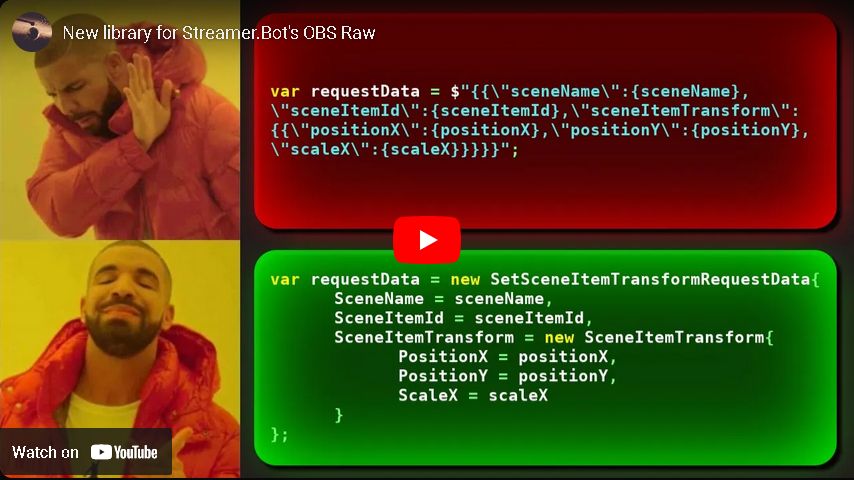

# TSO.SB.OBS

[](https://www.youtube.com/watch?v=tP5hMnZS3Tg)

Streamer.Bot helper library with OBS structures.

This repository contains a dynamic-link library (DLL) which you can use inside C# code sub-actions in Streamer.Bot's [`ObsSendRaw`](https://docs.streamer.bot/api/csharp/obs/raw#ObsSendRaw) method. It contains the set of structures for requset, response and event data used in OBS Websocket 5 ([OBS WebSocket protocol documentation](https://github.com/obsproject/obs-websocket/blob/master/docs/generated/protocol.md))

## Installation

- Place DLL in `Streamer.Bot/dlls/` folder (or any other)
- Add it to references in your C# sub-action (or in SB->Settings->C# Compiler->Common References)

## Usage

All names are in CamelCase style. 

Namespace's structure follows OBS WebSocket protocol structure, all types and enums are placed in root namespace `TSO.SB.OBS`.

Naming of structures is following: `RequestType` + `EventData` for events, `RequestType` + `RequestData` or `ResponseData`, depending on is it request or response.

More documentation will be added later ^_^

## Example

### GetSceneItemTransform

```
using System;
using Newtonsoft.Json;
using TSO.SB.OBS.SceneItems;

public class CPHInline
{
	public bool Execute()
	{
		var connection = 0;
		var sceneName = "Scene";
		var sourceName = "TestImage";
		
		var getSceneItemIdRequestType = "GetSceneItemId";
		var getSceneItemIdRequestData = new GetSceneItemIdRequestData{
			SceneName = sceneName,
			SourceName = sourceName
		};
		
		var data = JsonConvert.SerializeObject(getSceneItemIdRequestData);
		var getSceneItemIdResponse = CPH.ObsSendRaw(getSceneItemIdRequestType, data, connection);
		
		CPH.LogInfo(getSceneItemIdResponse);
		
		var getSceneItemIdResponseData = JsonConvert.DeserializeObject<GetSceneItemIdResponseData>(getSceneItemIdResponse);
		var sceneItemId = getSceneItemIdResponseData.SceneItemId;
		
		CPH.LogInfo($"Scene Item Id: {sceneItemId}");
		
		var getSceneItemTransformRequestType = "GetSceneItemTransform";
		var getSceneItemTransformRequestData = new GetSceneItemTransformRequestData{
			SceneName = sceneName,
			SceneItemId = sceneItemId
		};
		
		data = JsonConvert.SerializeObject(getSceneItemTransformRequestData);
		
		var getSceneItemTransformResponse = CPH.ObsSendRaw(getSceneItemTransformRequestType, data, connection);
		
		CPH.LogInfo(getSceneItemTransformResponse);
		
		var getSceneItemTransformResponseResponseData = JsonConvert.DeserializeObject<GetSceneItemTransformResponseData>(getSceneItemTransformResponse);
		
		var sceneItemTransform = getSceneItemTransformResponseResponseData.SceneItemTransform;

		CPH.LogInfo($"Alignment: {sceneItemTransform.Alignment}");
		CPH.LogInfo($"Rotation.: {sceneItemTransform.Rotation}");
		
		return true;
	}
}

```

### SetSceneItemTransform

```
using System;
using TSO.SB.OBS;
using TSO.SB.OBS.SceneItems;
using Newtonsoft.Json;

public class CPHInline
{
	public bool Execute()
	{
		var connection = 0;
		var sceneName = "Scene";
		var sourceName = "TestImage";
				
		var getSceneItemIdRequestType = "GetSceneItemId";
		var getSceneItemIdRequestData = new GetSceneItemIdRequestData{
			SceneName = sceneName,
			SourceName = sourceName
		};
		
		var data = JsonConvert.SerializeObject(getSceneItemIdRequestData);
		var getSceneItemIdResponse = CPH.ObsSendRaw(getSceneItemIdRequestType, data, connection);
		
		CPH.LogInfo(getSceneItemIdResponse);
		
		var getSceneItemIdResponseData = JsonConvert.DeserializeObject<GetSceneItemIdResponseData>(getSceneItemIdResponse);
		var sceneItemId = getSceneItemIdResponseData.SceneItemId;
		
		CPH.LogInfo($"Scene Item Id: {sceneItemId}");
		
		var setSceneItemTransformRequestType = "SetSceneItemTransform";
				
		var setSceneItemTransformRequestData = new SetSceneItemTransformRequestData{
			SceneName = sceneName,
			SceneItemId = sceneItemId,
			SceneItemTransform = new SceneItemTransform{
				PositionX = 1437.0,
				PositionY = 50.0,
				ScaleX = 1.0
			}
		};
		
		data = JsonConvert.SerializeObject(setSceneItemTransformRequestData);
		
		CPH.LogInfo(data);
		
		var setSceneItemIdResponse = CPH.ObsSendRaw(setSceneItemTransformRequestType, data, connection);
		
		CPH.LogInfo(setSceneItemIdResponse);
		
		return true;
	}
}

```
